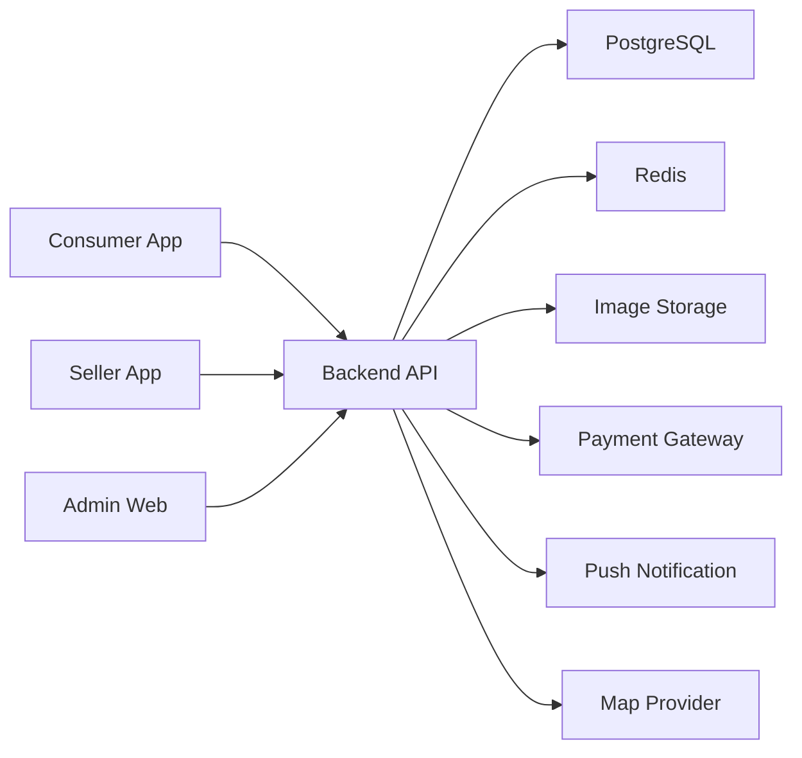

# Architecture

## System Overview

## Apps

### Consumer App

React Native + Expo 기반 모바일 앱입니다. 첫 화면은 지도보다 `오늘 픽업 가능한 마감박스` 리스트가 우선입니다.

### Seller App

React Native + Expo 기반 판매자 앱입니다. 핵심은 등록 시간을 30초 이하로 만드는 것입니다.

### Admin Web

Next.js 기반 관리자 페이지입니다. 입점, 주문, 결제, 정산, CS, 지역별 지표를 관리합니다.

### API

초기에는 Fastify 또는 NestJS를 사용할 수 있습니다. MVP에서는 단순 API를 먼저 만들고, 결제/정산/알림 기능이 커질 때 모듈화합니다.

## Key Domain Objects

- Store
- Seller
- Category
- SaveBox
- Order
- Payment
- Pickup
- Settlement
- Review
- AllergyTag
- StoreTemplate

## Integration Roadmap

1. Manual seller registration
2. Saved seller templates
3. POS CSV import
4. POS/API partner integration
5. Franchise and convenience store PoC

