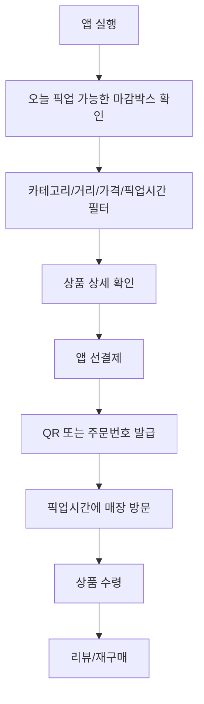
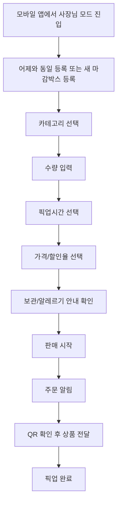
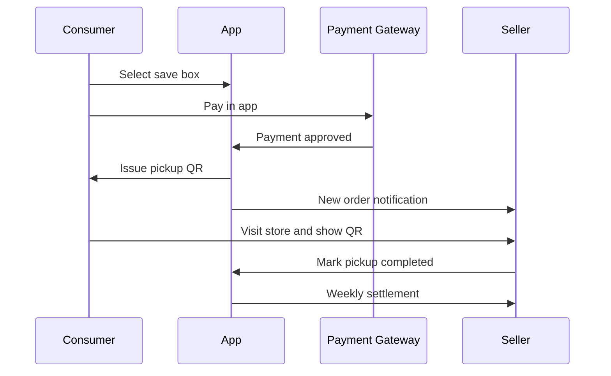

# User Flows

## Consumer Flow

```mermaid
flowchart TD
    A["앱 실행"] --> B["오늘 픽업 가능한 마감박스 확인"]
    B --> C["카테고리/거리/가격/픽업시간 필터"]
    C --> D["상품 상세 확인"]
    D --> E["앱 선결제"]
    E --> F["QR 또는 주문번호 발급"]
    F --> G["픽업시간에 매장 방문"]
    G --> H["상품 수령"]
    H --> I["리뷰/재구매"]
```

## Seller Flow

```mermaid
flowchart TD
    A["모바일 앱에서 사장님 모드 진입"] --> B["어제와 동일 등록 또는 새 마감박스 등록"]
    B --> C["카테고리 선택"]
    C --> D["수량 입력"]
    D --> E["픽업시간 선택"]
    E --> F["가격/할인율 선택"]
    F --> G["보관/알레르기 안내 확인"]
    G --> H["판매 시작"]
    H --> I["주문 알림"]
    I --> J["QR 확인 후 상품 전달"]
    J --> K["픽업 완료"]
```

## Payment Flow

```mermaid
sequenceDiagram
    participant Consumer
    participant App
    participant Payment as Payment Gateway
    participant Seller

    Consumer->>App: Select save box
    Consumer->>Payment: Pay in app
    Payment->>App: Payment approved
    App->>Consumer: Issue pickup QR
    App->>Seller: New order notification
    Consumer->>Seller: Visit store and show QR
    Seller->>App: Mark pickup completed
    App->>Seller: Weekly settlement
```
