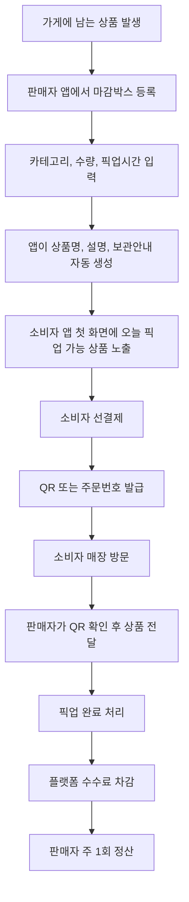
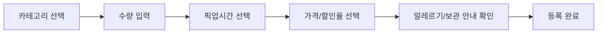
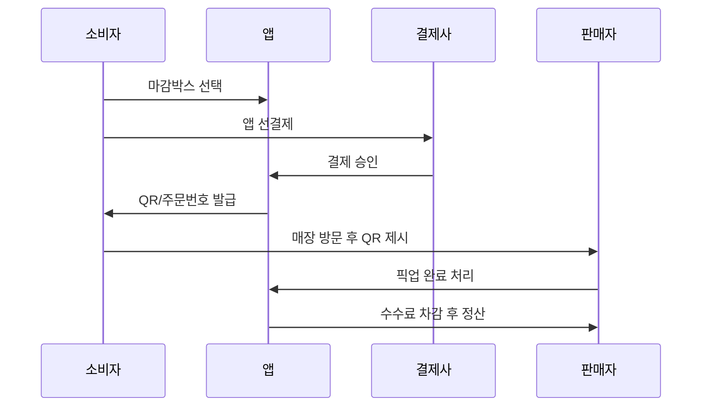

# 동네 마감박스 플랫폼 사업계획 정리본

작성일: 2026년 5월 27일  
사업 방향: 베이커리, 도시락, 반찬, 동네마트, 정육점, 과일가게, 카페 등 동네 신선식품 전체를 아우르는 마감박스 픽업 플랫폼

---

## 1. 한 줄 정의

동네 가게가 오늘 남거나 마감이 임박한 신선식품을 `마감박스`로 올리면, 소비자가 앱에서 선결제하고 정해진 시간에 매장에 방문해 픽업하는 푸드세이빙 플랫폼이다.

공급자에게는 **버릴 뻔한 상품을 30초 만에 돈으로 바꾸는 도구**이고, 소비자에게는 **오늘 근처에서 저렴하게 픽업하는 신선식품 마켓**이다.

---

## 2. 해결하려는 문제

### 공급자 문제

- 베이커리, 반찬가게, 도시락집, 카페, 과일가게, 정육점, 동네마트는 매일 남는 상품이 발생한다.
- 남는 상품은 할인 판매할 방법이 부족해 폐기되거나 손실로 처리된다.
- 사장님들은 새로운 앱 사용, 상품 등록, 결제, 정산, 고객 응대를 귀찮아한다.
- 실수로 수량을 잘못 올리거나 픽업 시간이 꼬이면 오히려 손해와 민원이 생긴다.

### 소비자 문제

- 물가 부담으로 가까운 곳에서 저렴한 식품을 사고 싶다.
- 할인 상품을 찾으려면 직접 매장에 가야 하거나 정보가 흩어져 있다.
- 임박 상품을 살 때 식품 안전, 소비기한, 보관 상태가 걱정된다.
- 배달비 없이 퇴근길, 하굣길, 집 근처에서 바로 픽업하고 싶다.

---

## 3. 핵심 해결 방식

### 서비스 원리

1. 가게에 남는 상품이 생긴다.
2. 판매자가 앱에서 마감박스를 등록한다.
3. 소비자가 앱 첫 화면에서 오늘 픽업 가능한 마감박스를 확인한다.
4. 소비자가 앱에서 선결제한다.
5. 소비자는 QR 또는 주문번호를 들고 정해진 시간에 방문한다.
6. 판매자는 상품을 전달하고 픽업 완료 처리한다.
7. 플랫폼은 수수료를 차감하고 판매자에게 정산한다.

### 중요 표현

앱과 제안서에서는 `폐기물`이라는 표현을 쓰지 않는다.

추천 표현:

- 마감임박
- 오늘소진
- 마감박스
- 푸드세이빙
- 잉여식품
- 소비기한 내 할인 상품
- 구조박스

---

## 4. 전체 서비스 플로우

---

## 5. 주요 고객

### 공급자

초기 우선순위:

1. 베이커리
2. 반찬가게
3. 도시락/샐러드 가게
4. 카페/디저트 가게
5. 과일가게
6. 동네마트
7. 정육점
8. 편의점

초기에는 베이커리와 반찬가게가 가장 좋다. 상품이 매일 남을 가능성이 높고, 마감박스 모델과 잘 맞으며, 식품 구성 설명을 단순화하기 쉽다.

### 소비자

- 대학생
- 자취생
- 직장인
- 1인 가구
- 신혼부부
- 물가에 민감한 가족 단위 고객
- 퇴근길에 식품을 픽업하고 싶은 소비자

---

## 6. 상품 카테고리 설계

| 카테고리 | 예시 상품 | 추천 판매 방식 |
|---|---|---|
| 베이커리 | 당일 빵, 샌드위치, 케이크 조각, 디저트 | 랜덤 마감박스 |
| 도시락 | 도시락, 샐러드, 샌드위치 | 카테고리 지정 박스 |
| 반찬 | 당일 반찬, 김밥, 튀김, 조리식품 | 당일소진 박스 |
| 동네마트 | 유제품, 간편식, 야채, 가공식품, 임박상품 | 임박특가 묶음 |
| 정육점 | 소비기한 임박 포장육, 양념육, 손질육 | 중량/보관 안내 필수 |
| 과일가게 | 숙성 과일, 흠집 과일, 못난이 과일 | 과일 구조박스 |
| 카페 | 샌드위치, 베이글, 디저트, 음료 | 마감 디저트 박스 |

---

## 7. 소비자 앱 설계

### 첫 화면 원칙

소비자 앱 첫 화면은 지도보다 **오늘 픽업 가능한 마감박스 리스트**가 먼저 떠야 한다.

소비자가 앱을 켜는 목적은 지도를 구경하는 것이 아니라 지금 살 수 있는 저렴한 상품을 찾는 것이기 때문이다.

### 핵심 기능

- 오늘 픽업 가능한 상품 리스트
- 내 근처 1km, 3km 필터
- 카테고리 필터
- 가격대 필터: 5천원 이하, 1만원 이하
- 픽업시간 필터: 점심, 퇴근길, 저녁, 마감 직전
- 마감임박순, 거리순, 할인율순, 인기순 정렬
- 앱 선결제
- QR 또는 주문번호 발급
- 픽업 완료 확인
- 리뷰 및 재구매
- 즐겨찾는 가게 등록
- 알레르기/보관 안내 확인

### 상품 카드 정보

- 가게명
- 카테고리
- 상품명
- 정가
- 할인가
- 할인율
- 남은 수량
- 거리
- 픽업 가능 시간
- 당일섭취/냉장보관/알레르기 표시
- 사진 1장 또는 기본 카테고리 이미지

---

## 8. 판매자 앱 설계

### 판매자 앱의 핵심 원칙

판매자가 귀찮으면 이 사업은 실패한다. 판매자 앱은 30초 안에 등록할 수 있어야 한다.

### 판매자가 직접 입력하는 항목

- 카테고리
- 수량
- 픽업시간
- 가격 또는 할인율
- 특이사항

### 앱이 자동으로 처리해야 하는 항목

- 상품명 자동 생성
- 카테고리별 설명 자동 입력
- 보관 안내 자동 입력
- 알레르기 체크 유도
- 정가/할인가 템플릿 저장
- 주문 발생 시 수량 자동 차감
- 수량 0개 시 자동 품절
- 픽업시간 종료 시 자동 판매 종료
- 정산 내역 자동 계산

### 판매자 첫 화면 버튼

- 어제와 동일하게 올리기
- 오늘 마감박스 만들기
- 판매 종료하기

### 등록 플로우

---

## 9. 결제 및 정산 구조

### 결제 원칙

현장결제보다 앱 선결제가 적합하다.

이유:

- 노쇼를 줄일 수 있다.
- 판매자가 상품을 빼놓고 기다리는 리스크를 줄인다.
- 플랫폼 수수료 회수가 가능하다.
- 예약 확정과 재고 차감이 자동으로 연결된다.

### 결제 플로우

### 예시 정산

베이커리 마감박스 판매가 6,900원 기준:

| 항목 | 금액 |
|---|---:|
| 소비자 결제금액 | 6,900원 |
| PG/카드 수수료 약 3% | 약 207원 |
| 플랫폼 수수료 10% | 690원 |
| 판매자 정산액 | 약 6,003원 |
| 플랫폼 매출 | 690원 |

---

## 10. 수익모델

### 초기 수익모델

- 입점비 0원
- 월 이용료 0원
- 첫 2~3개월 수수료 0~5%
- 이후 거래 수수료 10%
- 팔릴 때만 수수료 부과

### 중장기 수익모델

| 수익원 | 설명 |
|---|---|
| 거래 수수료 | 판매금액의 10~15% |
| 광고/상단노출 | 인기 마감박스, 추천 가게 노출 |
| 데이터 리포트 | 폐기 절감, 인기 시간대, 수요 예측 |
| B2B 제휴 | 프랜차이즈, 마트 체인, 지자체 ESG 사업 |
| POS 연동 수수료 | POS 업체와 연동 후 자동 등록 기능 제공 |
| 구독료 | 충분한 매출 효과가 입증된 뒤 판매자 프리미엄 기능 제공 |

---

## 11. 판매자 설득 전략

### 핵심 설득 문장

사장님, 매일 남는 상품 있으시죠? 저희가 그걸 근처 손님에게 앱 선결제로 팔아드릴게요. 입점비 없고, 안 팔리면 비용 없고, 첫 달은 수수료도 받지 않겠습니다. 오늘 3박스만 테스트해보실래요?

### 사장님 걱정과 답변

| 사장님 걱정 | 답변 |
|---|---|
| 귀찮지 않을까? | 카테고리, 수량, 픽업시간만 누르면 등록 가능 |
| 손해 보는 것 아닐까? | 어차피 남는 상품만 올리고 가격은 사장님이 직접 설정 |
| 손님이 안 오면? | 앱 선결제라 예약 확정 후 방문 |
| 정산이 복잡하지 않을까? | 주 1회 자동 정산 |
| 컴플레인이 생기면? | 픽업시간, 보관 안내, 알레르기 안내를 앱에서 고지 |
| 수수료가 부담될까? | 입점비/월 이용료 없이 팔릴 때만 수수료 |

### 초기 영업 방식

전국을 직접 영업하는 것은 불가능하다. 먼저 한 동네를 직접 영업해 성공 사례를 만들고, 이후 상인회, 지자체, POS 업체, 프랜차이즈와 제휴해 확장한다.

---

## 12. 초기 시장 진입 전략

### 첫 지역 선정 기준

- 대학가
- 원룸촌
- 오피스 밀집지역
- 아파트 단지 상권
- 전통시장 주변
- 지하철역 주변

### 첫 목표

전국 출시가 아니라 특정 동네에서 매일 픽업 가능한 마감박스가 30개 이상 뜨는 상태를 만든다.

### 초기 실행 순서

1. 한 동네 선정
2. 네이버지도에서 베이커리, 반찬가게, 도시락, 샐러드, 과일가게, 카페 리스트업
3. 100곳 후보 중 폐기/마감재고 가능성이 높은 30곳 우선 방문
4. 첫 달 수수료 무료 또는 5% 제안
5. 첫 등록은 운영팀이 대신 도와줌
6. 매장 홍보용 스티커와 QR 제공
7. 소비자 MVP로 첫 거래와 재구매율 검증

---

## 13. 확장 전략

### 1단계: 한 동네 직접 영업

- 베이커리, 반찬가게 중심 20~30곳 확보
- 실제 남는 상품, 가격, 픽업시간 패턴 파악
- 소비자 반응과 재구매율 확인

### 2단계: 운영 자동화

- 판매자 앱에서 직접 등록 가능하게 개선
- 어제와 동일하게 올리기 기능 제공
- 자동 품절, 자동 종료, 자동 정산 기능 안정화

### 3단계: 지역 파트너 확장

- 전통시장 상인회
- 소상공인연합회
- 지자체 소상공인과
- 대학교 창업지원단
- 지역 배달대행사
- 로컬 커뮤니티

### 4단계: B2B/체인 확장

- POS 업체 제휴
- 동네마트 체인 제휴
- 베이커리 프랜차이즈 제휴
- 편의점 본사 PoC 제안
- 지자체 ESG/식품폐기 감축 사업 연계

---

## 14. 데이터 전략

### 초기

기업 DB 없이 시작한다. 판매자가 직접 마감박스를 등록한다.

필요한 데이터:

- 가게 정보
- 카테고리
- 마감박스 수량
- 가격
- 픽업시간
- 주문/픽업 완료 여부
- 소비자 리뷰

### 중기

POS 업체, 동네마트, 프랜차이즈와 제휴해 등록을 자동화한다.

연동 대상:

- 상품명
- 판매기한/소비기한
- 재고 수량
- 할인 가격
- 판매 가능 시간

### 장기

편의점 본사, 마트 체인, 식품 유통사와 PoC를 통해 API 연동을 추진한다.

중요한 점:

공공데이터와 기업 내부 DB는 다르다. 편의점 재고, POS, 소비기한 데이터는 기업 내부 데이터이므로 본사 또는 점주 협약이 필요하다.

---

## 15. 공공데이터 활용 방향

공공데이터 경진대회에서는 편의점 내부 DB를 받는 것이 아니라, 공공데이터를 활용해 서비스의 예측/추천/검증 로직을 만드는 방향이 적합하다.

활용 가능한 공공데이터:

- 상권 데이터
- 생활인구/유동인구 데이터
- 날씨 데이터
- 지역 물가 데이터
- 식품안전 데이터
- 업소 위치 데이터
- 탄소배출/폐기물 감축 계수
- 취약계층/복지 수요 데이터

공모전 주제 문장:

공공데이터와 점포 입력 데이터를 결합해 동네 신선식품의 마감 판매 가능성을 예측하고, 소비자에게 근거리 픽업 상품을 추천하는 푸드세이빙 플랫폼.

---

## 16. 기술 스택 제안

### MVP 추천 스택

| 영역 | 추천 기술 |
|---|---|
| 소비자 앱 | React Native + Expo |
| 판매자 앱 | React Native + Expo |
| 관리자 웹 | Next.js |
| 백엔드 | NestJS 또는 FastAPI |
| DB | PostgreSQL |
| 실시간 재고/캐시 | Redis |
| 인증 | Supabase Auth 또는 Firebase Auth |
| 결제 | Toss Payments, NICE, KG이니시스 |
| 지도 | Kakao Map 또는 Naver Map |
| 알림 | Firebase Cloud Messaging |
| 이미지 저장 | AWS S3 또는 Cloudflare R2 |
| 분석 | GA4, Amplitude, Metabase |
| 배포 | AWS, GCP, Vercel, Railway |

### 가장 빠른 조합

초기 MVP는 `React Native + Expo + Supabase + Toss Payments + Kakao Map` 조합이 빠르다.

### 주요 테이블 예시

- users
- sellers
- stores
- products
- surprise_boxes
- orders
- payments
- pickups
- settlements
- reviews
- categories
- allergy_tags
- store_templates

---

## 17. 주요 화면

### 소비자 앱 화면

1. 오늘 픽업 가능한 마감박스
2. 카테고리별 목록
3. 상품 상세
4. 결제
5. 픽업 QR
6. 주문내역
7. 리뷰
8. 즐겨찾는 가게

### 판매자 앱 화면

1. 오늘 판매 현황
2. 마감박스 등록
3. 어제와 동일하게 등록
4. 주문/픽업 확인
5. 정산 내역
6. 가게 템플릿 관리

### 관리자 웹 화면

1. 입점 가게 관리
2. 상품/마감박스 관리
3. 주문/결제 관리
4. 정산 관리
5. CS/환불 관리
6. 지역별 거래량 분석
7. 폐기 절감/ESG 리포트

---

## 18. 운영 정책

### 환불 정책

- 픽업 시작 1시간 전까지 소비자 취소 가능
- 픽업시간 이후 미수령 시 환불 불가
- 매장 사정으로 상품 제공 불가 시 100% 환불
- 품질 문제가 있는 경우 앱 고객센터 접수 후 환불 또는 쿠폰 처리

### 식품 안전 정책

- 소비기한 내 상품만 등록 가능
- 냉장/냉동/상온 보관 안내 필수
- 당일섭취 권장 표시
- 알레르기 유발 가능성 표시
- 정육/반찬/도시락은 보관 및 픽업시간 관리 강화

### 실수 방지 정책

- 주문 발생 시 자동 재고 차감
- 수량 0개 시 자동 품절
- 픽업시간 종료 시 자동 판매 종료
- 판매자에게 주문 알림 발송
- 소비자에게 픽업 시작 전 알림 발송

---

## 19. 유사 서비스와 참고점

| 서비스 | 특징 | 배울 점 |
|---|---|---|
| Too Good To Go | 글로벌 잉여식품 Surprise Bag | 랜덤박스, 예약결제, 픽업 모델 |
| Flashfood | 마트/신선식품 임박상품 중심 | 정육, 과일, 마트 상품 운영 방식 |
| Yindii | 아시아권 잉여식품 할인 앱 | 아시아 시장에서의 Surprise Bag 모델 |
| ResQ Club | 잉여상품 할인 플랫폼 | 식품 외 상품 확장 가능성 |
| Karma | 음식점/마트/베이커리 잉여식품 할인 | 정확한 상품 선택형 참고 |
| Olio | 지역 기반 음식 나눔 | 커뮤니티와 지역성 참고 |
| treatsure | 호텔 뷔페/그로서리 잉여식품 | 호텔/뷔페 확장 가능성 |
| 라스트오더 | 국내 마감할인 앱 | 국내 소비자 인식과 편의점/마트 마감할인 |
| 럭키밀 | 베이커리 마감박스 | 베이커리 버티컬 초기 전략 |
| 오늘의할인 | 동네 맛집 마감할인 | 타임세일과 픽업 모델 |
| 떠리몰 | 임박/과다재고 이커머스 | 임박상품 수요 검증 |
| 큐마켓 | 동네마트 장보기/배송 | 동네마트 입점, POS, 신선식품 운영 |

---

## 20. 정부지원사업 및 공모전 활용

### 적합한 방향

- 민관협력 오픈이노베이션: 대기업/마트/편의점 PoC
- 환경분야 청년창업 지원사업: 식품폐기 감축
- ESG 지원사업: 폐기 절감, 탄소 감축
- 공공데이터 경진대회: 상권/날씨/유동인구 기반 수요예측
- 데이터바우처: 데이터 구매, 가공, AI 분석 비용 지원
- AI/PoC 지원사업: 수요예측, 할인율 추천, 폐기율 예측 모델 개발

### 지원서 핵심 문장

본 서비스는 동네 신선식품 판매자가 소비기한 내 마감임박 상품을 간편하게 등록하고, 소비자가 근거리에서 선결제 후 픽업할 수 있도록 연결하는 푸드세이빙 플랫폼이다. 공공데이터와 점포 입력 데이터를 결합해 수요를 예측하고, 식품폐기 감축과 소상공인 추가 매출 창출을 동시에 달성한다.

---

## 21. 핵심 지표

### 공급자 지표

- 입점 매장 수
- 일일 등록 마감박스 수
- 매장당 월 추가 매출
- 판매자 재등록률
- 판매자 이탈률

### 소비자 지표

- 가입자 수
- 첫 구매 전환율
- 재구매율
- 평균 주문 금액
- 픽업 완료율
- 노쇼율

### 사업 지표

- 월 거래액 GMV
- 플랫폼 수수료 매출
- 폐기 절감 박스 수
- 추정 탄소 절감량
- 지역별 상품 밀도

---

## 22. MVP 성공 기준

초기 MVP의 목표는 전국 출시가 아니다.

성공 기준:

- 한 동네에서 입점 매장 20~30곳 확보
- 매일 픽업 가능한 마감박스 30개 이상 노출
- 판매자 등록 시간 30초 이내
- 첫 구매 후 30일 내 재구매율 30% 이상
- 픽업 완료율 95% 이상
- 판매자 70% 이상이 2주 이상 반복 사용

---

## 23. 핵심 리스크와 대응

| 리스크 | 대응 |
|---|---|
| 판매자가 귀찮아서 안 씀 | 등록 항목 최소화, 템플릿, 어제와 동일 등록 |
| 상품이 적어서 소비자가 안 씀 | 한 동네 밀도 우선, 카테고리 집중 |
| 노쇼 발생 | 앱 선결제, 픽업시간 이후 환불 불가 |
| 식품안전 민원 | 소비기한 내 상품만 등록, 보관/알레르기 안내 |
| 가게가 손해 본다고 느낌 | 가격 자율 설정, 추가 매출 리포트 제공 |
| 전국 확장 어려움 | 상인회, 지자체, POS, 프랜차이즈 제휴 |
| 대기업 DB 접근 어려움 | 초기에는 직접 등록, 이후 PoC/API 연동 |

---

## 24. 최종 사업 방향

이 사업의 본질은 배달앱이 아니라 **근거리 신선식품 손실 회수 플랫폼**이다.

핵심은 기술보다 운영 설계다.

- 공급자는 안 귀찮아야 한다.
- 소비자는 앱을 켜자마자 살 상품이 보여야 한다.
- 결제는 선결제여야 한다.
- 픽업은 간단해야 한다.
- 수량과 시간이 꼬이지 않아야 한다.
- 식품 안전 신뢰가 있어야 한다.
- 전국보다 한 동네 밀도가 먼저다.

최종 한 문장:

**우리동네 마감박스는 동네 가게의 남는 신선식품을 소비자에게 저렴하게 연결해, 소상공인 추가 매출과 식품폐기 감축을 동시에 만드는 푸드세이빙 픽업 플랫폼이다.**
